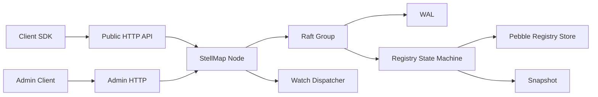

# StellMap Service

`StellMap` 是 StellHub 体系中的服务注册中心，中文名“星轴”。它面向分布式系统提供服务注册、服务发现、实例心跳、目录 Watch、线性一致读写和注册表持久化能力。

## 项目概述

`stellmap-service` 承载 StellMap 注册中心服务端实现。它的核心职责不是做通用 KV 或配置中心，而是维护一张强一致的服务实例注册表，让业务服务、网关、控制面和 SDK 能够可靠完成服务定位与目录感知。

## 当前状态

| 项目 | 说明 |
| --- | --- |
| 稳定性 | 开发中 |
| 服务类型 | 注册中心服务端 |
| 实现语言 | Go |
| 一致性模型 | CP / Raft |
| 存储组件 | WAL、Pebble、Snapshot |
| 对外协议 | HTTP / Admin HTTP / gRPC Internal |
| 维护方 | StellHub |

## 解决什么问题

- 服务实例注册、注销、心跳和发现。
- 维护 namespace、service、instanceId 维度的服务实例注册表。
- 通过 Raft 保证注册数据复制和线性一致读写。
- 支持服务目录 Watch，为 SDK、网关和控制面推送实例变化。
- 支持快照、WAL 和状态机恢复。

## 不解决什么问题

- 不做通用配置中心。
- 不做分布式事务系统。
- 不直接提供业务登录态和租户管理。
- 不实现业务层负载均衡策略，只提供可用实例和元数据。
- 不替代可观测性、限流、熔断等治理系统。

## 核心能力

| 能力 | 说明 | 典型场景 |
| --- | --- | --- |
| 服务注册 | 写入服务实例信息 | 服务启动上线 |
| 服务注销 | 删除实例记录 | 优雅下线 |
| 心跳续约 | 更新实例存活状态 | 健康状态维护 |
| 服务发现 | 查询服务候选实例 | 客户端发现、网关路由 |
| Watch | 推送实例和目录变化 | SDK 本地缓存刷新 |
| Raft 复制 | 多节点强一致写入 | Leader 切换、节点故障 |
| 线性一致读 | ReadIndex 读屏障 | 避免读到旧实例 |
| 快照恢复 | 状态机快照与日志压缩 | 节点重启、故障恢复 |

## 架构说明



`stellmapd` 通常由公共 HTTP、独立 Admin HTTP 和内部 gRPC 三个监听面组成。外部注册、查询和 Watch 请求进入公共 HTTP；集群内部复制和节点间通信走内部通道；管理类操作通过 Admin HTTP 隔离。

## 快速开始

### 构建

```bash
go build ./...
```

### 测试

```bash
go test ./...
```

### 启动本地节点

```bash
./stellmapd --config ./configs/local.yaml
```

如果仓库当前未提供 `stellmapd` 可执行入口或本地配置文件，应先补齐 `cmd/stellmapd` 与 `configs/local.yaml`。

## 配置说明

| 配置项 | 是否必填 | 默认值 | 说明 |
| --- | --- | --- | --- |
| node.id | 是 | 无 | 当前节点 ID |
| http.addr | 是 | `:8080` | 公共 HTTP 监听地址 |
| admin.addr | 是 | `:18080` | Admin HTTP 监听地址 |
| grpc.addr | 是 | `:19090` | 内部 gRPC 监听地址 |
| data.dir | 是 | `./data` | WAL、Pebble、Snapshot 根目录 |
| raft.peers | 是 | 无 | Raft 初始成员列表 |
| lease.defaultTTL | 否 | 30s | 默认实例租约 TTL |

## 数据模型

```text
namespace / service / instanceId -> RegistryInstance
```

- `namespace`：环境、租户或区域隔离。
- `service`：规范化完整服务名，例如 `company.trade.order.order-center.api`。
- `instanceId`：实例唯一标识。
- `RegistryInstance`：保存 endpoint、labels、metadata、lease、heartbeat 等信息。

## 本地开发

```bash
go mod tidy
go test ./...
go vet ./...
go build ./...
```

涉及 Raft、WAL、Snapshot、Lease、Watch 的改动必须补充测试。

## 版本与升级

- `MAJOR`：不兼容 API、存储格式或集群协议变更。
- `MINOR`：向后兼容的新能力。
- `PATCH`：向后兼容的问题修复。

升级前必须确认：Raft 日志和快照格式、Pebble key 编码、HTTP API、Watch 事件结构以及滚动升级兼容性。

## 可观测性

| 类型 | 名称 | 说明 |
| --- | --- | --- |
| Metric | raft_leader_changes_total | Leader 变更次数 |
| Metric | raft_apply_index | 状态机已 apply index |
| Metric | registry_instance_total | 注册实例数量 |
| Metric | watch_connection_total | Watch 连接数量 |
| Metric | heartbeat_timeout_total | 心跳超时清理次数 |
| Log | LEADER_CHANGED | Leader 发生切换 |
| Log | SNAPSHOT_CREATED | 创建快照 |
| Log | WATCH_DISPATCH_FAILED | Watch 事件分发失败 |

## 故障排查

### 写入失败

1. 检查当前节点是否为 Leader 或是否能转发到 Leader。
2. 检查 Raft 多数派是否存活。
3. 检查 WAL 目录是否可写。
4. 查看是否出现 `not_leader`、`no_leader` 或 proposal timeout 日志。

### 查询结果不符合预期

1. 确认读请求是否经过线性一致读屏障。
2. 检查实例是否已经租约过期。
3. 检查 namespace 和 service 是否匹配。
4. 检查状态机 apply index 是否落后。

## 安全说明

- Admin HTTP 不应暴露到公网。
- 内部 gRPC 端口只允许集群节点访问。
- 生产环境数据目录需要独立磁盘和备份策略。

## 目录结构

```text
.
├── cmd/            # 服务启动入口
├── internal/       # 服务端内部实现
├── pkg/            # 可复用公共包
├── configs/        # 本地和示例配置
├── docs/           # 架构、模块和运维文档
├── go.mod          # Go module
└── README.md       # 项目说明
```

## 贡献规范

- 涉及一致性、存储格式、集群协议的改动必须先写设计说明。
- 修改 Raft、WAL、Snapshot、Lease 逻辑必须补充测试。
- API 行为变更必须同步更新 SDK、README 和 docs。

## 支持

由 StellHub 维护。建议通过 GitHub Issues 记录问题、需求和设计讨论。

## 许可证

以仓库内 `LICENSE` 文件为准。